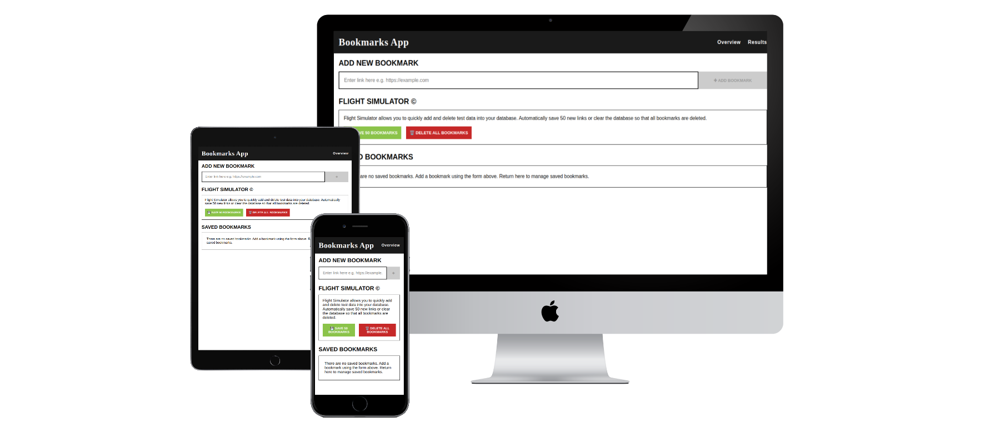

# Welcome to the Bookmarks Management App powered by PHQ



A live deployed version of the site can be found at https://phq-bookmarks.netlify.app/

This project uses the latest stable version of Angular. The specific version is mentioned below.

## Technical Design Documentation, Assumptions & Limitations

1. Since a design was not provided I opted to use my best judgement. The app uses rem units so that all fonts, spacing, typography, padding, margins are relative to the base font size of the browser.
2. Furthermore, to the first point typically we have back and forth interaction with the UX/UI design teams or the person who brings forward the project brief. Since none of these options are available to me I have opted to use my best judgement for the design.
3. The design is based on MUI colours and inspired by https://materialuicolors.co/
4. Project brief stipulates that we should use only HTML,CSS, JS or Angular. Hence, no external CSS or JS libraries were used. For example I could have used `fontawesome` or `material ui` icons but because of this stipulation I opted to use `emojis` instead.
5. iPhone SE 2020 (and above) is the smallest supported device. The browser/device must have a minimum viewport width of 375px. The project brief did not list the devices that required support. On small screen devices like the iPhone SE it is recommended to rotate the device horizontally and then use the Bookmarks Management App.
6. A bookmark is also referred to as a link, or URL.
7. Bookmarks must begin with either http:// or https://
8. Since we are limited to front end technologies only it is not feasible to completely check if a link exists according to the project brief. This would likely require a third party service or backend technologies which we are not using because of the conditions of this project.
9. LocalStorage is used as our "database" since we are limited to front end technologies we store our array of bookmarks as a local storage item. We could easily substitute this for any other local or backend form of storage.

## Getting Started with this project

1. Make sure you have the latest LTS version of Node & npm installed on your system. It is recommended to use nvm (node version maanger).
2. Clone this repo
3. Using terminal in the root folder of this project run `npm install`
4. When all packages are installed run `npm start` this will start a web server at `http://localhost:4200`

## Node Version

This project was built using the latest version of NodeJS LTS - v22.18.0. You can easily manage node version using node version manager.

## Angular Tips & More Information

This project was generated using [Angular CLI](https://github.com/angular/angular-cli) version 20.1.5.

## Development server

To start a local development server, run:

```bash
ng serve
```

Once the server is running, open your browser and navigate to `http://localhost:4200/`. The application will automatically reload whenever you modify any of the source files.

## Code scaffolding

Angular CLI includes powerful code scaffolding tools. To generate a new component, run:

```bash
ng generate component component-name
```

For a complete list of available schematics (such as `components`, `directives`, or `pipes`), run:

```bash
ng generate --help
```

## Building

To build the project run:

```bash
ng build
```

This will compile your project and store the build artifacts in the `dist/` directory. By default, the production build optimizes your application for performance and speed.

## Running unit tests

To execute unit tests with the [Karma](https://karma-runner.github.io) test runner, use the following command:

```bash
ng test
```

## Running end-to-end tests

For end-to-end (e2e) testing, run:

```bash
ng e2e
```

Angular CLI does not come with an end-to-end testing framework by default. You can choose one that suits your needs.

## Additional Resources

For more information on using the Angular CLI, including detailed command references, visit the [Angular CLI Overview and Command Reference](https://angular.dev/tools/cli) page.
